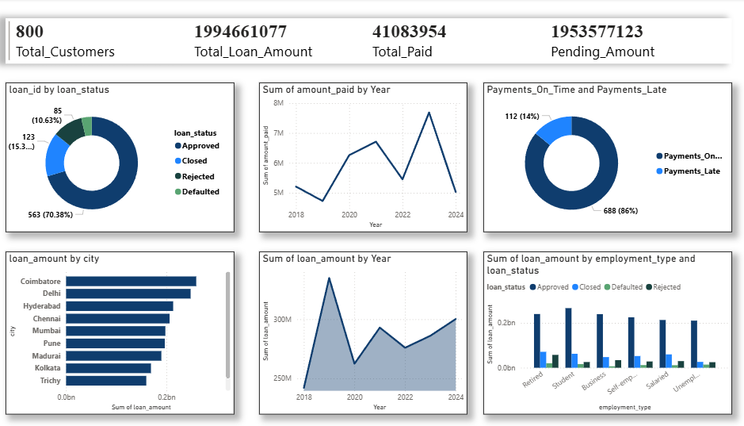

# 🏦 Loan Analysis Using SQL & Power BI  

## 📌 Project Overview  

This project implements a full data-analytics workflow for loan portfolio management. Using **SQL** for data ingestion and transformation + **Power BI** for visualization.

## 🖼️ Data Model Diagram   

The system is built on three interrelated tables:


Relationships:  
```
customers.customer_id → loans.customer_id  
loans.loan_id → payments.loan_id
```

## 📊 Dashboard  

The Power BI dashboard presents a clean, executive-style view



## ▶️ How to Run  

### 1️⃣ Set up the Database  
- Run `import_queries.sql` to import raw data (CSV or provided datasets) into tables  
- Run `main.sql` to populate derived tables and calculate KPIs/aggregations  

### 2️⃣ Launch Dashboard  
- Open `loan.pbix` in Power BI  
- Connect to the database (e.g. MySQL / chosen engine)  
- Click **Refresh** → dashboard will auto-update reflecting latest data  


## 🏁 Conclusion  

This repository delivers a **production-style loan analytics solution** — combining robust data engineering (SQL) with business-ready visualization (Power BI).  


