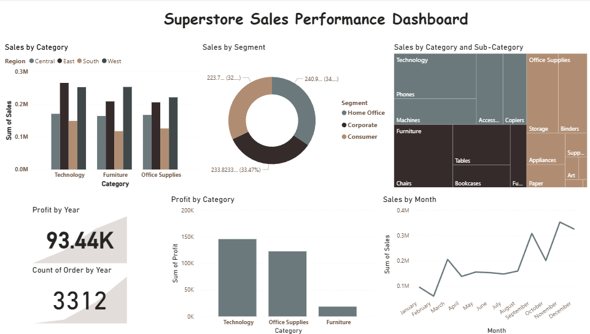

# 🛒 Superstore Sales Performance Analysis

A complete data analytics case study focused on understanding sales, profit, customer segments, regional performance, and forecasting opportunities.

## 🔍 Project Overview
The Superstore dataset contains 3+ years of order data including:
- Sales, Profit, Quantity  
- Category & Sub-category  
- Customer Segment , Region ,Ship Mode , Discounts



## 🔧 Data Cleaning
- Removed blank rows & null values  
- Standardized date columns  
- Created new metrics:
  - Profit Margin
  - Order Processing Time
  - 
## 🚀 How to Run the Project

Clone the repository
```
git clone https://github.com/TomDev210/data-analytics.git
```
Open the project folder
```
cd data-analytics/superstore-analysis
```
Open the Power BI Dashboard
- Double-click superstore.pbix
- Power BI Desktop will load all visuals and data automatically.

## 📝 Conclusion
This project helps businesses optimize pricing, control discounts, and improve regional sales strategies.

